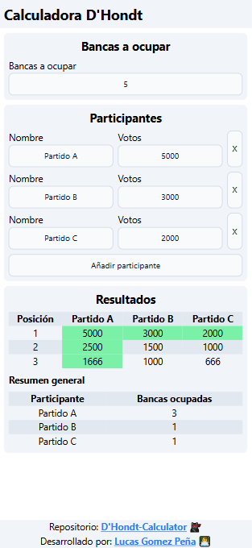

# DhondtCalculator

Este proyecto es una calculadora del método D'Hondt, un sistema de representación proporcional por listas empleado en varios sistemas electorales para asignar escaños en función de los votos.

## Descripción

La Calculadora del Método D'Hondt es una herramienta sencilla basada en web diseñada para calcular la distribución de escaños entre los partidos políticos utilizando el método D'Hondt. Permite a los usuarios ingresar los votos obtenidos por cada partido y el número total de escaños a asignar. Luego, la aplicación calcula y muestra la distribución de escaños según el método D'Hondt.

## Características

* Interfaz fácil de usar: Interfaz simple e intuitiva para ingresar datos y ver los resultados.
* Cálculo preciso: Implementación precisa del algoritmo del método D'Hondt.
* Visualización de resultados: Muestra la distribución de escaños para cada partido.

## Instalación

Clona el repositorio:
```Bash
git clone https://github.com/Lucas-GomezP/DhondtCalculator.git
```

Instala las dependencias:
```Bash
cd DhondtCalculator
npm install
```

Inicia la aplicación:
```Bash
npm run dev
```

## Uso

Introduce el número de escaños a asignar en el campo correspondiente.
Introduce los votos obtenidos por cada partido en los campos correspondientes.
Los resultados se mostraran automaticamente en la seccion de resultados.

## Contribuir

Las contribuciones son bienvenidas. Si encuentras algún error o tienes alguna sugerencia de mejora, no dudes en abrir un issue o enviar un pull request.   

1. Haz un fork del repositorio.
2. Crea una rama para tu contribución: git checkout -b mi-contribucion.
3. Realiza los cambios y haz commit: git commit -m 'Añade alguna característica'.   
4. Sube los cambios a tu fork: git push origin mi-contribucion.
5. Abre un pull request.

## Licencia
Este proyecto se distribuye bajo la licencia MIT. Consulta el archivo LICENSE para obtener más información.

## Créditos
Este proyecto fue desarrollado por Lucas Gomez Peña.

## Captura de Pantalla

